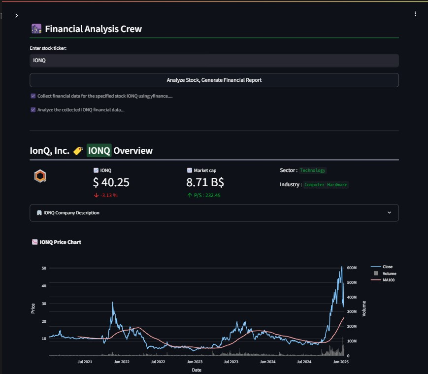
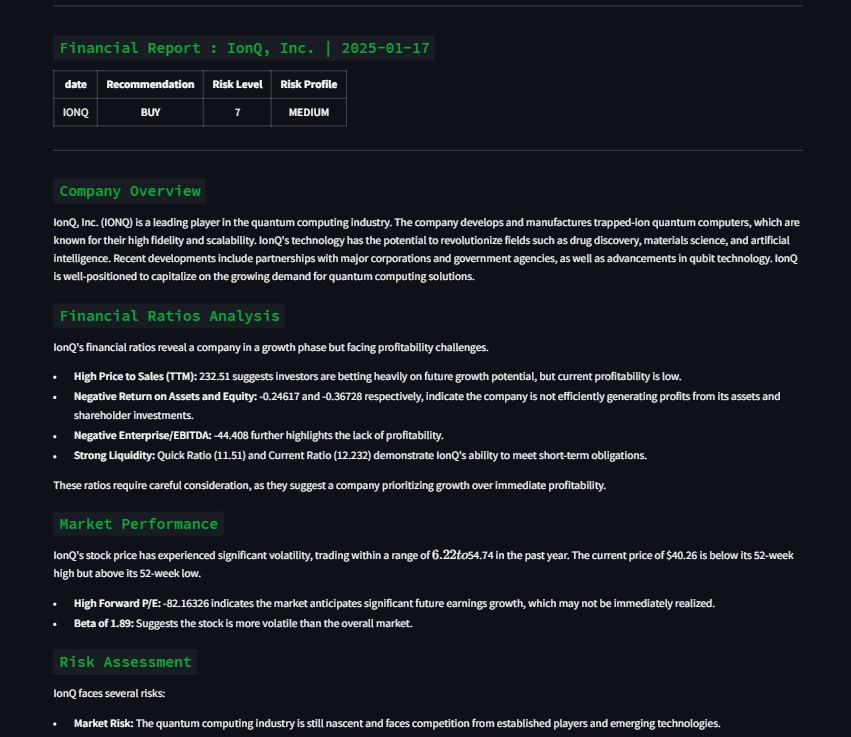

# 🌆 Financial Analysis Crew

The Financial Analysis Crew is a Streamlit application designed to assist in comprehensive financial stock analysis. It leverages the power of cutting-edge LLMs and tools to collect, analyze, and report on financial data efficiently.

---

## Interface :



## Features

- **Financial Data Collection:** Uses advanced agents to gather data for specified stock tickers.
- **Detailed Analysis Reports:** Generates in-depth financial reports using AI-driven analysis.
- **Interactive Interface:** Simple and intuitive interface powered by Streamlit.

---

## Requirements

- Python 3.8+
- Streamlit
- `yfinance`
- `crewai`
- Your API key for the `groq` models.

---

## How it works : 

- Agent-Based Design:
The app employs two agents:

- Collector: Gathers stock data using YFinance and other tools.
  
- Reporter: Analyzes the collected data to produce actionable insights.

LLM Integration:
Utilizes groq/gemma2-9b-it and groq/mixtral-8x7b-32768 models for natural language understanding and response generation.

Interactive Display:
Users can input stock tickers and view real-time data and analysis results.


---

## Installation

1. Clone the repository:

   ```bash
   git clone https://github.com/your-username/financial-analysis-crew.git
   cd financial-analysis-crew
   ```

2. Installation :

   ```bash
   pip install -r requirements.txt

   ```

3. Setup secrets :
Create a .streamlit/secrets.toml file and add

   ```bash
   [GROQ_API]
   GROQ_API = "your_api_key"
   ```
  
4. Run :

   ```bash
   streamlit run app.py

   ```

   
   

